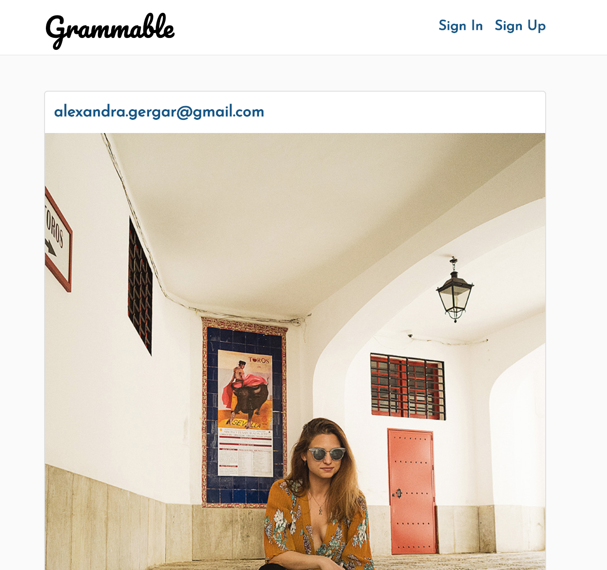
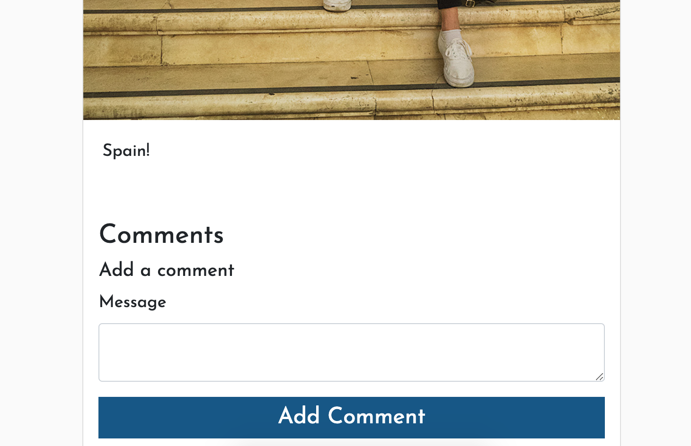

# README

Grammable is a Instagram Style App that was built with Ruby on Rails.

You can see a live version here: https://grammable-alex-gergar.herokuapp.com/

This site allows users to photos and then comment on others photos. 

This was created to be learn the process of testing applications. 

See screenshots below.

